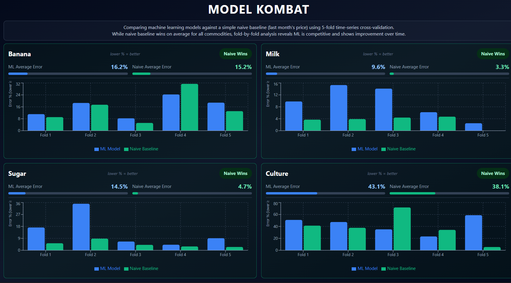

# Price-Forecasting-Pipeline

End-to-end data pipeline for collecting, processing, and analyzing food ingredient prices in Nigeria. Includes ML model testing with rigorous cross-validation to compare predictions against simple baselines.

## What This Does

Collects food price data from multiple sources, cleans and integrates it, then tests whether machine learning models can predict future prices better than just using last month's price. Uses 5-fold time-series cross-validation for robust evaluation.

## Key Findings

### The Nuanced Story

While naive baseline (last month's price) wins on average for all 4 commodities, fold-by-fold analysis reveals a more complex picture:

- **Culture**: ML models win 2 out of 5 folds, with one huge win (Fold 3: 35.1% vs 71.8%)
- **Banana**: Essentially a tie - ML wins 1/5 folds, average difference only 1% (16.2% vs 15.2%)
- **Sugar**: ML shows clear improvement over time, getting very close in later folds (4.2% vs 2.9% in Fold 4)
- **Milk**: One lucky 0.0% case (price didn't change) skews the average in naive's favor

### Important Insights

1. **Averages can be misleading** - Always examine individual test cases, not just summary statistics
2. **ML is competitive** - Wins 3 out of 20 individual folds (15%), showing it's not a complete failure
3. **Lucky cases matter** - 0.0% errors from unchanged prices are luck, not skill, and can skew averages
4. **ML shows learning** - Performance improves over time in cross-validation, suggesting it would benefit from more data
5. **Limited data is the real constraint** - With only 48 monthly observations, both methods struggle

**Takeaway**: In datasets with limited observations, both ML and naive baselines struggle. The real lesson is the importance of examining fold-by-fold performance, not just averages, and being cautious of "perfect" predictions that may be lucky rather than skillful.

## Tech Stack

- Python, Pandas, NumPy for data processing
- scikit-learn, XGBoost for ML models
- Matplotlib, Seaborn for visualization
- Jupyter for analysis

## Quick Start

### Prerequisites
- Python 3.7+
- pip

### Installation

```bash
# Create virtual environment (recommended)
python -m venv venv

# Activate virtual environment
# Windows:
venv\Scripts\activate
# macOS/Linux:
source venv/bin/activate

# Install dependencies
pip install -r requirements.txt
```

### View Analysis

```bash
# Start Jupyter Notebook
jupyter notebook
```

Open `analysis.ipynb` to see:
- Data collection and sources
- Data transformation and feature engineering
- Model training and evaluation
- Baseline comparison results with fold-by-fold analysis

### View Dashboard

See the interactive dashboard screenshot below. The dashboard visualizes fold-by-fold cross-validation results, showing how ML models compare to the naive baseline across different test periods.



## Project Structure

```
├── data/
│   ├── raw/              # Raw source data
│   └── processed/        # Processed data 
├── dashboard/            # Interactive React dashboard
├── analysis.ipynb        # Main analysis notebook
├── requirements.txt      # Python dependencies
└── README.md            # This file
```

## Data Sources

### Core Food Price Data
- **WFP (World Food Programme)**: Retail food prices for Nigeria (Milk, Bananas, Sugar)
- **UN Comtrade**: Starter culture import data (bacteria for yogurt production)

### External Signals
- **Fuel Prices**: NBS official rates (PMS/Petrol, AGO/Diesel) - collected via web scraping
- **Forex Rates**: Calculated from WFP data
- **Inflation**: NBS CPI data - collected via web scraping

## Output

The pipeline generates:
- **Integrated Dataset** (`data/integrated_food_prices.csv`): Monthly prices (2022-2025) for all ingredients in NGN and USD, plus external signals
- **Analysis Results**: Fold-by-fold comparison of ML models vs simple baseline for each commodity
- **Interactive Dashboard**: Visual exploration of cross-validation results

## Documentation

- **This README**: Project overview and key findings
- **`analysis.ipynb`**: Complete data processing, transformation, and model evaluation workflow